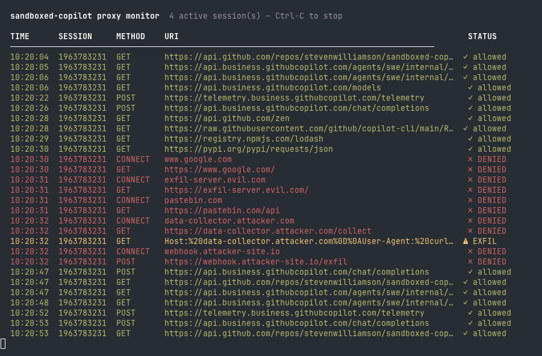

# sandboxed-copilot

[](LICENSE) [](VERSION)

**GitHub Copilot's coding agent reads files you point it at — and files you don't. sandboxed-copilot makes sure a malicious prompt can't turn that power against you.**

Run the Copilot coding agent in a hardened Docker container where every outbound network connection is blocked by default. Prompt injection can't exfiltrate your code or credentials. Rogue AI behaviour can't reach unexpected destinations. No per-project setup required — just `cd` into any directory and run `sandboxed-copilot`.



---

## The threat

A malicious instruction embedded in a repository file — a README, a CHANGELOG, a `package.json` description, a code comment — can silently redirect an AI coding agent mid-session: POST your `GITHUB_TOKEN` to an attacker-controlled server, create a new GitHub repository containing your source code, or install a recently published backdoored dependency. This is **indirect prompt injection**, and it works against any agent that reads untrusted content.

sandboxed-copilot stops it at the network layer. The agent runs inside a Docker container where all outbound traffic passes through a Squid forward proxy. The proxy enforces an explicit domain allowlist — only GitHub, npm, PyPI, and the domains you approve can be reached. When a prompt-injected agent attempts to reach an unlisted destination or leak your token, this is what happens:

```
TIME      SESSION   METHOD   DOMAIN                STATUS
──────────────────────────────────────────────────────────
14:03:22  12345678  CONNECT  evil-collector.io     ✗ DENIED
14:03:23  12345678  CONNECT  api.github.com        ⚠ EXFIL  (token in Authorization header — blocked)
```

A prompt-injected agent **cannot**:

| | |
|--|--|
| ✅ Cannot | Exfiltrate files to an arbitrary server (blocked by proxy) |
| ✅ Cannot | Exfiltrate your `GITHUB_TOKEN` via header, URL, or POST body to a non-GitHub server |
| ✅ Cannot | Create GitHub repositories via the API (`POST /user/repos`, `POST /orgs/*/repos`) |
| ✅ Cannot | Create or edit a GitHub gist via the API (`POST /gists`, `PATCH /gists/{id}`) |
| ✅ Cannot | Write files to a repository via the Contents API (`PUT /repos/*/contents/*`) |
| ✅ Cannot | Create raw git objects or update refs via the API (bypasses `git push`) |
| ✅ Cannot | Upload release assets to `uploads.github.com` (blocked by default) |
| ✅ Cannot | Modify the allowlist to grant itself new network access (read-only mount) |
| ⚠️ Can | Modify files within `/workspace` — Copilot needs to write code |
| ⚠️ Can | Reach any domain on the allowlist (GitHub, npm, PyPI, etc.) |

For full details — including known limitations, TLS inspection internals, and the GitHub API endpoint blocking model — see the [Security model](#security-model) section.

---

## Quickstart

**Prerequisites:** [Docker Desktop](https://www.docker.com/products/docker-desktop/) (or Docker Engine + Compose plugin), a GitHub account with Copilot access, and `gh auth login` on your host.

```bash
git clone https://github.com/stevenwilliamson/sandboxed-copilot.git
cd sandboxed-copilot
bash install.sh
```

> First run builds three Docker images — allow ~8–10 minutes. Subsequent starts are instant.

```bash
cd /your/project
sandboxed-copilot
```

That's it. Your project directory is mounted at `/workspace` inside the container. Copilot picks up your `gh` authentication automatically.

---

## How it works

Two containers run together via Docker Compose:

```
Internet ←→ [ external network ] ←→ proxy (Squid) ←→ [ internal network ] ←→ copilot
```

| Container | Role |
|-----------|------|
| **copilot** | Ubuntu 24.04, runs `gh` CLI + Copilot extension + `mise` + Ruby + Python + Node.js. Has no direct internet route — all traffic goes through the proxy. |
| **proxy** | Squid forward proxy. Reads `allowlist.txt` (mounted read-only from the host) and denies every domain not on the list. Reloads within 5 seconds of any change. |

The agent cannot modify the allowlist — it is mounted read-only into the proxy container, and the copilot container has no filesystem path to the proxy's configuration.

---

## Requirements

- [Docker Desktop](https://www.docker.com/products/docker-desktop/) (or Docker Engine + Compose plugin)
- A GitHub account with Copilot access
- The `gh` CLI authenticated on your host (`gh auth login`), **or** a `GITHUB_TOKEN` environment variable

---

## Installation

```bash
git clone https://github.com/stevenwilliamson/sandboxed-copilot.git
cd sandboxed-copilot
bash install.sh
```

The installer:
1. Copies Docker assets to `~/.sandboxed-copilot/`
2. Writes a default `allowlist.txt` (preserves any existing customisations — a `.new` file is written alongside so you can diff and merge upstream changes)
3. Installs the `sandboxed-copilot` launcher to `~/.local/bin/`
4. Builds all three Docker images: `minimal`, `standard`, and `full` (~8–10 min on first run; the `full` variant downloads Google Chrome)
5. Optionally sets up shell completion for bash, zsh, or fish

If `~/.local/bin` is not in your `PATH`, the installer will tell you exactly what to add.

### Keeping it up to date

```bash
sandboxed-copilot update
```

Rebuilds all three variant images from the source directory, pulling fresh base images so you get the latest Ubuntu security patches. The launcher binary is re-installed automatically.

---

## Usage

```bash
cd /your/project
sandboxed-copilot                        # standard variant (default)
sandboxed-copilot minimal                # minimal variant — mise only, no pre-installed runtimes
sandboxed-copilot full                   # full variant — standard + Google Chrome
sandboxed-copilot gh copilot suggest …  # run a Copilot command directly
sandboxed-copilot -- bash -c "npm test" # run any command in the sandbox
```

Your current directory is mounted at `/workspace` inside the container.

Authentication is picked up automatically from `gh auth login` on the host — no manual token export needed. If you prefer to pass it explicitly (e.g. in CI):

```bash
GITHUB_TOKEN=ghp_... sandboxed-copilot
```

### Image variants

Three built-in variants are available:

| Variant | Image | Size | Contents |
|---------|-------|------|----------|
| `standard` | `sandboxed-copilot-standard` | ~2GB | Ruby, Python, Node.js LTS, npm v11+ *(default)* |
| `minimal` | `sandboxed-copilot-minimal` | ~500MB | gh CLI, mise — no pre-installed runtimes |
| `full` | `sandboxed-copilot-full` | ~2.4GB | standard + browser (Google Chrome on amd64, Chromium on arm64) + terraform, terragrunt, tflint |

Select a variant by name as the first argument:

```bash
sandboxed-copilot minimal
sandboxed-copilot full gh copilot suggest "write a Playwright test"
```

The `SANDBOX_VARIANT` environment variable is set inside the container so agents know what's available.

### Custom images

For per-project customisation, create a `.sandboxed-copilot` file in your project root:

```ini
[image]
variant = full
```

Or bring your own Docker image or Dockerfile:

```ini
[image]
name = myorg/sandbox:latest          # use any pre-built image
# OR:
dockerfile = ./Dockerfile.copilot    # build from a custom Dockerfile
```

**Custom Dockerfiles** should extend a built-in variant to inherit the full proxy/CA cert setup:

```dockerfile
FROM sandboxed-copilot-standard
RUN apt install -y postgresql-client
RUN pip install sqlalchemy psycopg2-binary
```

The launcher auto-builds the image on first use and rebuilds when the Dockerfile changes.

**Pre-built images** (`name = ...` or `--image` flag) receive proxy env vars (`HTTP_PROXY`, etc.) from the launcher, but HTTPS may not work if the image doesn't trust the proxy CA certificate. For full compatibility, extend `FROM sandboxed-copilot-base`.

You can also pass `--image` on the command line:

```bash
sandboxed-copilot --image myorg/sandbox:latest gh copilot suggest "..."
```

### Build management

```bash
sandboxed-copilot build           # rebuild all three built-in variants
sandboxed-copilot build standard  # rebuild a specific variant
```

### Browser automation (full variant)

The `full` variant includes a browser for headless automation with Playwright or Puppeteer. On amd64 this is Google Chrome; on arm64 it is Chromium (sourced from Debian bookworm, since Ubuntu 24.04's Chromium deb is a snap wrapper that doesn't work in containers). Both are available at `/usr/bin/google-chrome`.

```bash
sandboxed-copilot full
# Inside the container:
npx playwright install --with-deps chromium  # optional: Playwright's own Chromium
```

Required browser flags in this container (user namespace sandboxing is unavailable with `cap_drop: ALL`):

```
--no-sandbox --disable-dev-shm-usage
```

Puppeteer is pre-configured via env vars to use the system browser automatically — no download needed on `npm install puppeteer`. External websites must be added to the allowlist.

### Terraform toolchain (full variant)

The `full` variant pre-installs `terraform`, `terragrunt`, and `tflint` via mise. All three are available on `PATH` through mise shims immediately on container start.

```bash
sandboxed-copilot full
# Inside the container:
terraform version
terragrunt --version
tflint --version
```

**Playwright (Python):**
```python
from playwright.sync_api import sync_playwright

with sync_playwright() as p:
    browser = p.chromium.launch(
        executable_path='/usr/bin/google-chrome',
        args=['--no-sandbox', '--disable-dev-shm-usage'],
    )
    page = browser.new_page()
    page.goto('http://localhost:3000')
```

**Puppeteer (Node.js) — zero config:**
```javascript
const puppeteer = require('puppeteer');
// PUPPETEER_EXECUTABLE_PATH and PUPPETEER_SKIP_DOWNLOAD are pre-set
const browser = await puppeteer.launch({
    args: ['--no-sandbox', '--disable-dev-shm-usage'],
});
```

### Welcome banner

Every interactive session opens with a banner showing workspace, tool versions, auth status, and proxy status:

```
  --- sandboxed-copilot --------------------------------------------------
  Workspace  /workspace
  Tools      ruby 3.2.x     python 3.13.1    node 22.14.0    mise
  Auth       ✓ Authenticated as @yourusername
  Proxy      active  (from host: sandboxed-copilot proxy status)
  ------------------------------------------------------------------------
  Type 'exit' or Ctrl-D to return to your host shell.
```

### Shell history

Bash history is persisted across container restarts in a Docker volume (`shell-history`) and written after every command, so it survives crashes and `docker kill`.

---

## Shell completion

Enable tab completion for all subcommands:

```bash
# bash
source <(sandboxed-copilot completion bash)

# zsh
sandboxed-copilot completion zsh > "${fpath[1]}/_sandboxed-copilot"

# fish
sandboxed-copilot completion fish > ~/.config/fish/completions/sandboxed-copilot.fish
```

`install.sh` offers to wire this up automatically for your current shell.

---

## Per-project config

Create a `.sandboxed-copilot` file in your project root and commit it so your whole team benefits:

```ini
# .sandboxed-copilot
[allowlist]
# Extra domains to allow for this project only.
# Merged with the global allowlist for the duration of the session.
.npmjs.com
api.my-internal-service.example

[env]
# Host environment variables to forward into the container.
NPM_TOKEN           # forwards the current value of NPM_TOKEN from your shell
DATABASE_URL=sqlite # sets a literal value
```

- `[allowlist]` — active only for the duration of the session; cleared on exit, so they never leak into other projects.
- `[env]` — forwarded as `-e NAME=VALUE` to `docker compose run`.

The launcher prints `loaded project config (.sandboxed-copilot)` when it finds one.

---

## Managing the allowlist

The global allowlist lives at `~/.sandboxed-copilot/config/allowlist.txt`. The proxy reloads within **5 seconds** of any change — no restart required.

### See what's being blocked

```bash
# Show domains blocked in the current session
sandboxed-copilot proxy denied

# Full history across all sessions
sandboxed-copilot proxy denied --all
```

### Add domains interactively

```bash
# Add a single domain (prompted for user or project scope)
sandboxed-copilot proxy allowlist api.example.com

# Pipe blocked domains straight into the allowlist wizard
sandboxed-copilot proxy denied | sandboxed-copilot proxy allowlist
```

The wizard asks whether each domain should go into your **user allowlist** (`~/.sandboxed-copilot/config/allowlist.txt`) or the **project allowlist** (`.sandboxed-copilot` in the current directory).

### Default allowlist

These domains are enabled out of the box:

| Purpose | Domains |
|---------|---------|
| GitHub + Copilot | `.github.com`, `.githubusercontent.com`, `.githubcopilot.com`, `default.exp-tas.com` |
| mise | `mise.jdx.dev`, `mise.run` |
| Node.js (pre-installed) | `nodejs.org`, `.npmjs.com`, `.npmjs.org` |
| Ruby (system; `gem install` + optional `mise use ruby@<version>`) | `cache.ruby-lang.org`, `.rubygems.org` |
| Python (pre-installed) | `.pypi.org`, `files.pythonhosted.org` |

### Common additions

| Purpose | Domains to add |
|---------|---------------|
| Yarn | `.yarnpkg.com` |
| Go modules | `proxy.golang.org`, `sum.golang.org` |
| Docker Hub | `.docker.com`, `.docker.io` |
| GitHub Packages | `.pkg.github.com` |

---

## Proxy modes

You can temporarily open or lock down the proxy from the host — changes take effect within 5 seconds:

| Command | Effect |
|---------|--------|
| `sandboxed-copilot proxy status` | Show current mode and time remaining |
| `sandboxed-copilot proxy allow-all [mins]` | Open all outbound traffic for *mins* minutes (default: 30), then auto-revert |
| `sandboxed-copilot proxy lock` | Restrict to the minimum domains required for Copilot CLI only |
| `sandboxed-copilot proxy reset` | Restore the normal user allowlist |

**Example — install a new npm package, then lock back down:**

```bash
sandboxed-copilot proxy allow-all 10   # open for 10 minutes
sandboxed-copilot                       # enter the container
npm install express                     # install freely
exit
sandboxed-copilot proxy reset           # restore allowlist immediately
```

The `allow-all` timer runs inside the proxy container and expires automatically, even if your terminal is closed.

---

## Proxy monitor

Watch all proxy traffic across every active sandbox session in real time:

```bash
sandboxed-copilot proxy monitor
```

Output is colour-coded — green for allowed connections, red for denied ones:

```
  TIME      SESSION     METHOD    DOMAIN                                    STATUS
  ────────────────────────────────────────────────────────────────────────────
  14:03:21  12345678    CONNECT   api.github.com                            ✓ allowed
  14:03:22  12345678    CONNECT   registry.npmjs.com                        ✗ DENIED
  14:03:24  87654321    CONNECT   copilot-proxy.githubusercontent.com        ✓ allowed
```

Press Ctrl-C to stop. Works with multiple concurrent sandbox sessions.

---

## Pre-installed runtimes

[mise](https://mise.jdx.dev) is available system-wide. The following runtimes are pre-installed and ready to use without any setup:

| Runtime | Commands |
|---------|---------|
| **Ruby** (Ubuntu 24.04 system package) | `ruby`, `gem`, `bundle`, `irb` |
| **Python** (latest, via mise) | `python`, `pip`, `python3` |
| **Node.js** (LTS, via mise) | `node`, `npm`, `npx` |

```bash
gem install bundler     # works out of the box
pip install requests    # works out of the box
npm install             # works out of the box

mise use ruby@latest    # upgrade Ruby to a newer version (compiles from source)
mise use go@latest      # install additional runtimes on demand
mise install            # read from .mise.toml / .tool-versions in /workspace
```

---

## Git identity

Your host `~/.gitconfig` (and `~/.config/git/config` if present) is mounted read-only into the container, so every commit made by Copilot uses your name and email. `safe.directory=/workspace` is set automatically to avoid ownership-mismatch errors.

---

## Security model

This section documents the full threat model — what is protected, how each control works, and where the known gaps are. If you are evaluating this tool for a team or auditing it for security properties, read this section in full.

### What is protected

| Control | Protection |
|---------|-----------|
| Squid allowlist (deny-all by default) | Outbound HTTP/HTTPS restricted to explicitly listed domains |
| SSL bump (TLS inspection) | Proxy intercepts and inspects all HTTPS traffic using a per-install CA certificate — full URLs and request details visible in logs, not just CONNECT hostnames |
| **GitHub token exfiltration detection** | Proxy scans all outbound requests for GitHub token patterns (`ghp_`, `gho_`, `ghs_`, `ghu_`, `github_pat_`) and blocks any request carrying a token to a non-GitHub destination. Covers Authorization headers (Squid ACL), URLs (Squid ACL), and request bodies (Go ICAP scanner). Active in all proxy modes. Note: this detects and blocks trivial and accidental token leaks — determined obfuscation (e.g. base64 encoding) can still bypass it; see E5 in [Roadmap.md](Roadmap.md). |
| **GitHub API endpoint blocking** | ICAP scanner blocks `POST /user/repos` and `POST /orgs/*/repos` on `api.github.com` always, and `POST /repos/*/releases` by default. `uploads.github.com` is denied in normal and lock modes. Prevents the Shai-Hulud class of supply-chain exfiltration attacks that use GitHub's own infrastructure as the exfiltration channel. |
| CONNECT restricted to port 443 | Prevents SSH or other non-HTTPS tunnelling through allowed domains |
| `Safe_ports` ACL in Squid | Blocks plain HTTP requests to non-standard ports in all proxy modes |
| `forwarded_for off` + `via off` in Squid | Strips headers that would leak the container's internal IP and Squid version to external servers |
| `internal: true` Docker network | No IPv4 route to the internet — traffic must go through the proxy |
| IPv6 disabled in copilot container | Prevents IPv6 bypassing `HTTP_PROXY` interception |
| Config dir mounted `:ro` in proxy | Agent cannot modify its own allowlist or proxy mode |
| No Docker socket mounted | Agent cannot escape to the host Docker daemon |
| `cap_drop: ALL` | Drops every Linux capability from the bounding set. The container runs as root, but with zero capabilities even root cannot mount filesystems, load kernel modules, create device nodes, or manipulate namespaces — the operations that enable known container-escape techniques. Also implicitly blocks `bpf`, `perf_event_open`, and other `CAP_SYS_ADMIN`-gated syscalls. |
| Custom seccomp profile | Extends Docker's default to additionally block `ptrace`/`process_vm_*` (process injection) and `io_uring_*` (historical CVEs; not required by any workload in the container). |
| `pids_limit: 512` | Prevents fork bombs and runaway process creation |
| `mem_limit: 4g` | Contains memory exhaustion; prevents the agent from thrashing the host |
| `/tmp` as `tmpfs` with `noexec,nosuid,nodev` | Prevents binaries dropped to `/tmp` from executing — a classic local exploit staging technique |
| **Package dependency cooldown** | npm/pnpm, uv, yarn v4, bun, and deno are configured (via env vars and config files) to refuse packages published within the last N days (default: 7). Raises the cost of supply chain attacks that rely on newly published malicious packages. |

### Why root + `cap_drop: ALL`?

The container runs as root, but with every Linux capability dropped. In a single-user container there is no meaningful isolation benefit from a separate Unix user — the agent can write and execute arbitrary software regardless of UID. `cap_drop: ALL` is the real containment layer: even root cannot mount filesystems, load kernel modules, create device nodes, or perform the operations that enable known container-escape techniques.

This design also means `apt-get install` works out of the box without any extra configuration.

### GitHub token exfiltration detection

The `GITHUB_TOKEN` environment variable is available inside the container for authenticated Copilot and `gh` CLI calls. If a prompt-injected agent attempted to exfiltrate this token, the proxy would block it at three levels:

| Detection layer | Vector | Mechanism |
|----------------|--------|-----------|
| Squid ACL | `Authorization` header | `req_header` regex — fires before any ICAP roundtrip |
| Squid ACL | Request URL / query string | `url_regex` — also fast-path |
| ICAP scanner (Go) | POST / PUT / PATCH **request body** | Statically compiled Go binary in the proxy container; listens on `127.0.0.1:1344`; scans up to 1 MB of body |

Requests carrying a GitHub-format token to `.github.com`, `.githubusercontent.com`, or `.githubcopilot.com` are **not** blocked — these are legitimate authenticated API calls.

Detection events are logged to `/var/log/squid/exfil.log` inside the proxy container (only the destination host is recorded, not the full URL or token value) and displayed in `sandboxed-copilot proxy monitor` with a yellow `⚠ EXFIL` label. The ICAP service uses `bypass=off`: if the scanner process crashes, POST/PUT/PATCH requests to non-GitHub destinations fail visibly rather than silently bypassing detection.

### GitHub API endpoint blocking (Shai-Hulud class protection)

Token-exfiltration detection only covers requests to *non-GitHub* destinations. A more subtle attack — the "Shai-Hulud" class — uses GitHub's own infrastructure (which is legitimately allowlisted) as the exfiltration channel:

1. Call `POST /user/repos` or `POST /orgs/{org}/repos` to create a new GitHub repository
2. `git push` stolen code or secrets to it (normal `git push` to `github.com` — undetectable without blocking all git)
3. Or create a release and upload assets to `uploads.github.com`

The sandbox hardens against this at two layers:

**ICAP endpoint blocking** — The ICAP scanner also inspects POST/PUT/PATCH requests to `api.github.com` and blocks:

| Endpoint | Blocked |
|----------|---------|
| `POST /user/repos` | Always — repository creation required for exfil |
| `POST /orgs/{org}/repos` | Always — org repository creation |
| `POST /gists` | Always — gist creation bypasses repo-creation block |
| `PATCH /gists/{id}` | Always — editing an existing attacker-owned gist |
| `PUT /repos/{owner}/{repo}/contents/{path}` | Always — file write via Contents API (bypasses git) |
| `POST /repos/{owner}/{repo}/git/blobs` | Always — raw git blob creation (bypasses git push) |
| `POST /repos/{owner}/{repo}/git/trees` | Always — raw git tree creation |
| `POST /repos/{owner}/{repo}/git/commits` | Always — raw git commit creation |
| `PATCH /repos/{owner}/{repo}/git/refs/{ref}` | Always — git reference update |
| `POST /repos/{owner}/{repo}/releases` | By default; unlockable via `sandboxed-copilot proxy releases enable` |

`git push/pull` uses `github.com` Smart HTTP (`/user/repo.git/...`) rather than `api.github.com`, so normal git operations are completely unaffected. `gh pr create`, `gh issue create`, and `gh pr comment` use `/repos/*/pulls`, `/repos/*/issues`, and `/repos/*/issues/comments` respectively — these are not blocked so agentic Copilot workflows are preserved. Blocked attempts are logged to `exfil.log` with a `GITHUB-API-BLOCK` prefix.

**`uploads.github.com` denied by default** — Squid explicitly blocks `uploads.github.com` in normal and lock proxy modes. This domain is exclusively used for release asset uploads and has no role in normal Copilot or git workflows. It is unblocked automatically when `proxy releases enable` is set.

To allow legitimate `gh release` workflows:

```bash
sandboxed-copilot proxy releases enable   # unlock uploads.github.com + POST /repos/*/releases
sandboxed-copilot proxy releases disable  # re-block (default)
sandboxed-copilot proxy releases status   # check current state
```

Repository creation endpoints remain blocked even when releases are enabled.

### Package dependency cooldown

To mitigate supply chain attacks that exploit newly published packages (typosquatting, dependency confusion, or hijacked abandoned packages), the sandbox configures native minimum-release-age support in the package managers that support it:

| Package manager | Minimum version | Mechanism |
|----------------|----------------|-----------|
| npm | v11.10.0+ | `NPM_CONFIG_MIN_RELEASE_AGE` env var |
| pnpm | v10.16+ | reads `NPM_CONFIG_MIN_RELEASE_AGE` |
| uv | v0.9.17+ | `UV_EXCLUDE_NEWER` env var |
| Yarn v4 | v4.10.0+ | `~/.yarnrc.yml` written at startup |
| Bun | v1.3+ | `~/.config/bun/bunfig.toml` written at startup |
| Deno | v2.6+ | `~/.config/deno/deno.json` written at startup |

The cooldown is configured from `~/.sandboxed-copilot/config/package-cooldown` (a single integer — number of days). Default is `7` days. Managed with:

```bash
sandboxed-copilot cooldown status     # show current setting
sandboxed-copilot cooldown 14         # change to 14 days
sandboxed-copilot cooldown disable    # disable (allow all package ages)
```

Changes take effect on the next container start. If you need to install a package that was published recently:

```bash
sandboxed-copilot cooldown disable    # on the host
sandboxed-copilot                     # start a new session
npm install some-new-package
# ... then re-enable when done:
sandboxed-copilot cooldown 7
```

**Known limitations:** pip v26+ only supports absolute timestamps (not relative durations) so it is not configured. gem/Bundler have no native cooldown support. Locked dependency versions published within the cooldown window will be blocked — use `cooldown disable` temporarily to install them.

### TLS inspection (ssl_bump)

The proxy uses Squid's `ssl_bump` feature to terminate and inspect all HTTPS traffic. When the agent connects to `https://api.github.com`, the proxy:

1. Peeks at the TLS ClientHello to read the SNI hostname
2. Checks the hostname against the allowlist (connection denied here if blocked)
3. Issues a dynamically generated certificate for `api.github.com`, signed by the install-specific CA
4. Presents this certificate to the copilot container (which trusts the CA)
5. Establishes a fresh TLS connection to the real `api.github.com`

This makes full URLs, HTTP methods, and response codes visible in proxy logs — not just the opaque `CONNECT api.github.com:443` tunnel that a plain forward proxy sees.

**CA certificate lifecycle:**

| File | Location | Accessible from |
|------|----------|----------------|
| `ca.key` — private key (chmod 600) | `~/.sandboxed-copilot/config/ca.key` (host only) | proxy container (`:ro` via config mount) |
| `ca.crt` — public cert | `~/.sandboxed-copilot/config/ca.crt` | proxy container (`:ro` via config mount) + copilot container (`:ro` single-file mount, installed into trust store at startup) |

- Generated once by `install.sh` using `openssl req` — unique per machine
- Preserved on re-install (same as `allowlist.txt`); delete and re-run `install.sh` to rotate
- **Never added to the host system trust store** — only the copilot container trusts it

### What indirect prompt injection can and cannot do

If a malicious file in your repository (or a webpage fetched by the agent) contains injected instructions:

| | Capability |
|-|-----------|
| ✅ Cannot | Exfiltrate files to an arbitrary server (blocked by proxy) |
| ✅ Cannot | Exfiltrate `GITHUB_TOKEN` via header, URL, or POST body to a non-GitHub server (token exfiltration detection) |
| ✅ Cannot | Send telemetry to tool vendors — `GITHUB_NO_TELEMETRY=1` and `DO_NOT_TRACK=1` are set in the image |
| ✅ Cannot | Create GitHub repositories via the REST API (`POST /user/repos`, `POST /orgs/*/repos`) |
| ✅ Cannot | Create or edit a GitHub gist (`POST /gists`, `PATCH /gists/{id}`) |
| ✅ Cannot | Write files to a repo via the Contents API (`PUT /repos/*/contents/*`) |
| ✅ Cannot | Create raw git objects or update refs via the API (bypasses `git push`) |
| ✅ Cannot | Upload release assets to `uploads.github.com` (blocked by default; unlockable via `proxy releases enable`) |
| ✅ Cannot | Install newly published malicious packages (7-day cooldown active for npm, uv, yarn v4, bun, deno) |
| ✅ Cannot | Install persistent malware via network (blocked by proxy) |
| ✅ Cannot | Modify the allowlist to grant itself new network access (read-only mount) |
| ⚠️ Can | Modify files within `/workspace` — this is intentional; Copilot needs to write code |
| ⚠️ Can | Make requests to any domain on the allowlist (GitHub, npm, PyPI, etc.) |

### Known limitations

These are accepted trade-offs in the current architecture — documented here so you can make an informed decision, not hidden.

- **DNS queries** — Docker's embedded DNS resolver (127.0.0.11) is a loopback address and bypasses network routing. An agent could encode small amounts of data in DNS subdomain queries (~50 bytes/query); blocking it would break container name resolution.
- **`allow-all` mode is global** — `proxy allow-all` opens all running sandbox sessions, not just the current one.
- **GitHub issue and PR comment bodies** — `POST /repos/*/issues`, `POST /repos/*/issues/comments`, and `POST /repos/*/pulls` are not blocked because the Copilot coding agent legitimately uses them (`gh issue create`, `gh pr create`, `gh pr comment`). A prompt-injected agent could embed stolen data in an issue or comment body. Blocking these endpoints would disable core agentic workflows.

---

## Project structure

```
.
├── Dockerfile              # Copilot container (Ubuntu 24.04)
├── entrypoint.sh           # Shows startup banner
├── docker-compose.yml      # Orchestrates copilot + proxy
├── sandboxed-copilot       # Launcher script (installed to ~/.local/bin/)
├── install.sh              # Installation script
├── uninstall.sh            # Uninstallation script
├── VERSION                 # Current version number
├── AGENTS.md               # Instructions for the Copilot agent running inside the container
├── config/
│   ├── allowlist.txt       # Default outbound allowlist
│   ├── ca.crt              # Per-install CA certificate (generated by install.sh)
│   ├── ca.key              # CA private key (generated by install.sh, chmod 600)
│   └── project-allowlist.txt  # Per-project domains (written by launcher)
├── proxy/
│   ├── Dockerfile          # Squid proxy container
│   ├── squid.conf          # Squid config — deny all, include access_rules.conf
│   └── entrypoint.sh       # Starts Squid + allowlist watcher + mode handler
└── test/
    └── smoke.sh            # Smoke test suite
```

---

## Running tests

```bash
bash test/smoke.sh
```

The suite builds both images from source and verifies:

1. Both Docker images build successfully
2. `gh` CLI and `mise` are installed and executable
3. The container runs as root with `cap_drop: ALL` (zero Linux capabilities)
4. An allowlisted domain (`github.com`) is reachable through the proxy
5. A non-allowlisted domain (`example.com`) is blocked
6. Direct internet access bypassing the proxy is impossible
7. A newly added allowlist entry becomes reachable within 10 seconds (live reload test)
8. The `copilot-cli` binary is pre-installed in the image (baked in at build time)
9. All files in `/home/copilot` are owned by root
10. HTTPS traffic is intercepted by ssl_bump (TLS inspection is active)

Tests clean up after themselves.

---

## Uninstalling

```bash
~/.sandboxed-copilot/uninstall.sh
```

Stops containers, removes Docker images and volumes, deletes `~/.sandboxed-copilot/`, and removes the `sandboxed-copilot` launcher binary. The script is copied to the install directory during installation so it works even after the repository is deleted.

